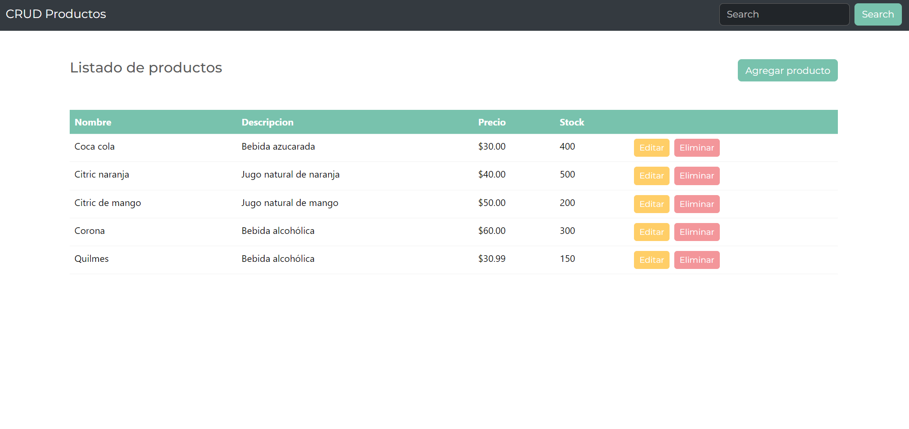
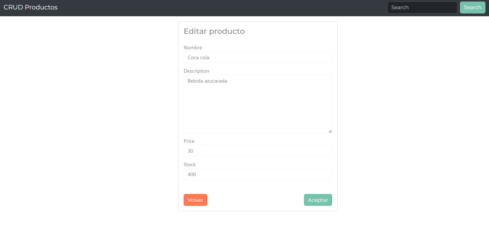
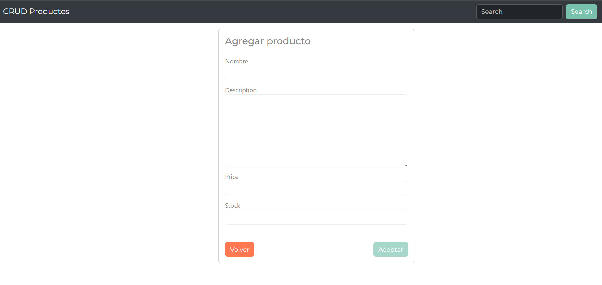
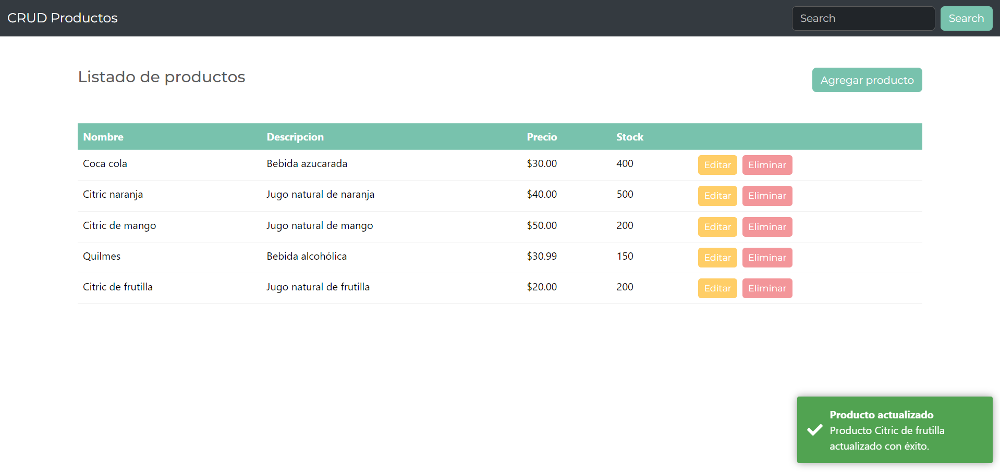
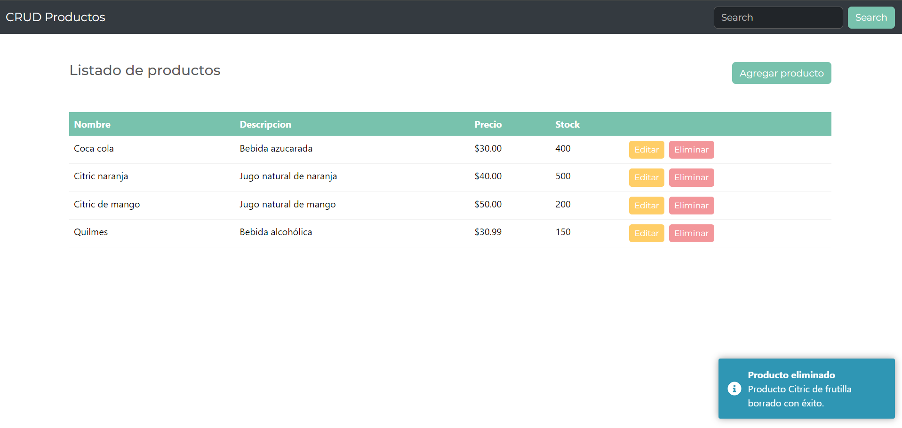

# **APP DE GESTIÓN DE PRODUCTOS 🚀**

## **📌 DESCRIPCIÓN DEL PROYECTO**

¡Bienvenido a nuestra aplicación de gestión de productos! Esta aplicación te permite administrar fácilmente tu inventario, agregar nuevos productos, editar los existentes y eliminar los que ya no necesitas. Con una interfaz intuitiva y características emocionantes.

En este proyecto podrás:
<br />
<br />
✅ Ver la lista de productos disponibles y mantener un seguimiento de tu inventario.
<br />
✅ Agregar nuevos productos a tu inventario con detalles completos como nombre, descripción, precio, etc.
<br />
✅ Editar la información de los productos existentes, como actualizar el precio o la cantidad disponible.
<br />
✅ Eliminar productos que ya no estén en tu inventario.
<br />
✅ Buscar productos por nombre o categoría para encontrar rápidamente lo que necesitas.

<br />
¡Simplifica la gestión de tu inventario y mantén tus productos organizados de manera eficiente !

<br />

## **🦾 TECNOLOGÍAS**

Este proyecto está construido utilizando las siguientes tecnologías:

- **JavaScript**, **HTML**, **CSS**, **Angular**, **Node**, **Express**, **PostgreSQL**, **Sequelize**, **Bootstrap**

<br />

## **📍 VISTAS**

**📍 HOME PAGE**



**📍 EDIT PAGE**



**📍 ADD PAGE**



**📍 TOASTS**





## **⚠️ REQUISITOS PARA INSTALAR LOCALMENTE**

1. Crea un archivo .env en la carpeta server.
2. Agrega las siguientes variables de entorno en el archivo .env:

   ```
    PORT = 3003
    DB_PASSWORD=
    DB_DATABASE= 'products'
    DB_USER=
   ```

<br />

**⚠️ INSTALACIÓN**

Utiliza npm para instalar las dependencias necesarias. Ejecuta este comando dentro de las carpetas frontend y backend:

`npm i`

**⚠️ EJECUCIÓN LOCAL**

Para ejecutar la aplicación localmente, sigue estos pasos:

- Backend -> dentro de ./backend

`npm run start`

- Frontend -> dentro de ./frontend

`npm run start`

<br />
